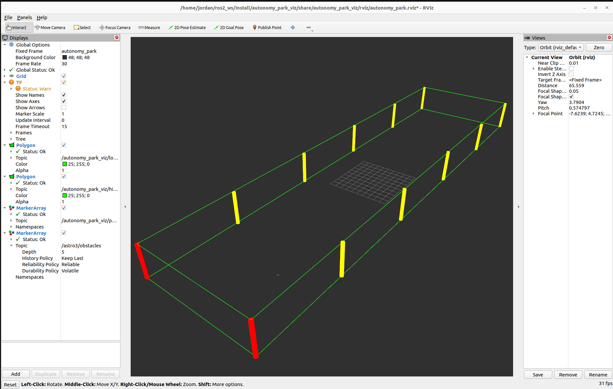

# autonomy_park_viz
 
A ROS2 package that renders a real-time visualization of the Autonomy Park in RViz2. The node publishes the park boundary polygon and net post markers in a local `autonomy_park` coordinate frame relative to an origin at the center of the park. Agents broadcast their position by publishing TF2 transforms into this frame.
 

 
## How it works
 
- **Park geometry** is loaded from `param/park_geometry.yaml`, which defines the four boundary corners and twelve net post positions in local (x, y) coordinates (units: meters).
- The `AutonomyParkViz` node publishes a `PolygonStamped` for the park border and a `MarkerArray` for the net posts.
- Agent nodes publish their own TF2 transforms relative to `autonomy_park`. RViz2 resolves the full transform tree and renders each agent's frame in context.
- The included RViz2 config (`rviz/autonomy_park.rviz`) is loaded automatically by the launch file.
 
## Dependencies
 
- ROS2
- `rclcpp`, `tf2`, `tf2_ros`, `tf2_geometry_msgs`
- `geometry_msgs`, `visualization_msgs`, `std_msgs`
 
## Build
 
```bash
cd <your_ws>
colcon build --packages-select autonomy_park_viz
source install/setup.bash
```
 
## Launch
 
```bash
ros2 launch autonomy_park_viz viz.launch.py
```
 
This starts the visualization node (with park geometry parameters) and opens RViz2 with the preconfigured display layout.
 
## Configuration
 
Park geometry is defined in `param/park_geometry.yaml`:
 
```yaml
/**:
  ros__parameters:
    border_x: [...]   # 4 corner x-coordinates (meters)
    border_y: [...]   # 4 corner y-coordinates (meters)
    post_x:   [...]   # 12 net post x-coordinates (meters)
    post_y:   [...]   # 12 net post y-coordinates (meters)
```
