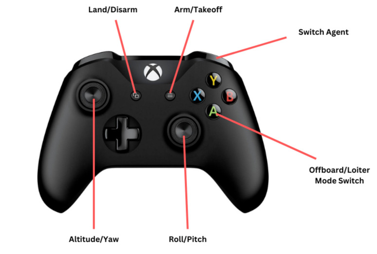

# PX4_TELEOP

## Overview
px4_teleop provides a joystick-driven teleoperation interface for PX4 flight controllers. It handles arming, takeoff, landing, flight mode switching, and velocity commands through a mapped Xbox controller. It supports swarm control in the multiagent branch, the operator can switch between connected agents at runtime, while the package tracks neighbor states (pose, velocity, flight mode) across the swarm.

A 'JoyHandler' interface is provided for interpretting joystick commands.

The 'ExperimentRunner' interface provides a structure for autonomous experiments (e.g. leader-follower), triggered via ROS2 service calls defined in the 'swarm_interfaces' library.

---

Dependencies

| Package | Notes |
|---|---|
| `rclcpp` | ROS 2 common library |
| `mavros` / `mavros_msgs` | PX4 bridge |
| `sensor_msgs`, `geometry_msgs`, `geographic_msgs` | State message types |
| `tf2`, `tf2_ros`, `tf2_geometry_msgs` | Coordinate transforms |
| `visualization_msgs` | RViz markers |
| `px4_safety_lib` | Safety library |
| `swarm_interfaces` | Custom swarm coordination messages |
| `fleet_manager` | Fleet management node |

---

## Package Structure

```
px4_teleop/
├── include/
│   ├── PX4Teleop.hpp        # Main teleoperation node
│   ├── JoyHandler.hpp       # Xbox controller input parser
│   └── ExperimentRunner.hpp # Abstract base for experiment plugins
├── src/
│   ├── PX4Teleop.cpp
│   ├── JoyHandler.cpp
│   ├── px4_teleop_node.cpp  # Node entry point
│   └── Experiment/          # Experiment implementations
├── launch/
│   ├── n1.launch.py                   # Single agent (namespace: n1)
│   ├── n2.launch.py                   # Single agent (namespace: n2)
│   ├── n3.launch.py                   # Single agent (namespace: n3)
│   ├── n4.launch.py                   # Single agent (namespace: n4)
│   ├── sim_teleop_viz.launch.py       # Simulation + RViz
│   └── astro3_teleop_viz.launch.py    # Hardware (Astro3) + RViz
└── param/
    ├── button_config.yaml     # Xbox button index mapping
    ├── joy_config.yaml        # Joystick driver settings
    ├── teleop_config.yaml     # Velocity limits
    ├── experiment_test.yaml   # Example experiment parameters
    ├── sim_obstacles.yaml     # Simulation obstacle definitions
    └── astro3_obstacles.yaml  # Hardware obstacle definitions
```
---
## Joycon Controlls

---
## Nodes & Topics

### Published

| Topic | Type | Description |
|---|---|---|
| `/<agent>/setpoint_velocity/cmd_vel` | `geometry_msgs/TwistStamped` | Agent command velocity |
| `/<agent>/prepare_experiment_response` | `swarm_interfaces/PrepareExperimentResponse` | Experiment handshake |
| `/<agent>/initiate_takeoff_response` | `swarm_interfaces/InitiateTakeoffResponse` | Coordinated takeoff ACK |
| `/<agent>/initiate_land_response` | `swarm_interfaces/InitiateLandResponse` | Coordinated land ACK |

### Subscribed

| Topic | Type | Description |
|---|---|---|
| `/joy` | `sensor_msgs/Joy` | Xbox controller input |
| `/connected_agents` | `swarm_interfaces/ConnectedAgents` | Swarm agent list |
| `/active_agent` | `std_msgs/String` | Currently controlled agent |
| `/<agent>/state` | `mavros_msgs/State` | FCU connection and mode |
| `/<agent>/extended_state` | `mavros_msgs/ExtendedState` | Landed state |
| `/<agent>/altitude` | `mavros_msgs/Altitude` | Altitude (amsl/lidar) |
| `/<agent>/global_position/global` | `sensor_msgs/NavSatFix` | GPS fix |
| `/<agent>/local_position/pose` | `geometry_msgs/PoseStamped` | Local pose |

### Service Clients (per agent)

- `/<agent>/set_mode` — Flight mode switching
- `/<agent>/cmd/arming` — Arm / Disarm
- `/<agent>/cmd/takeoff` — Takeoff
- `/<agent>/cmd/land` — Land
